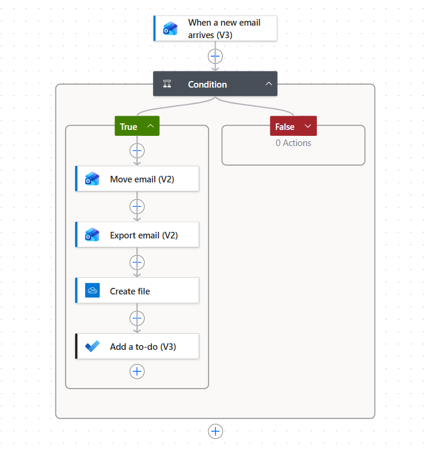
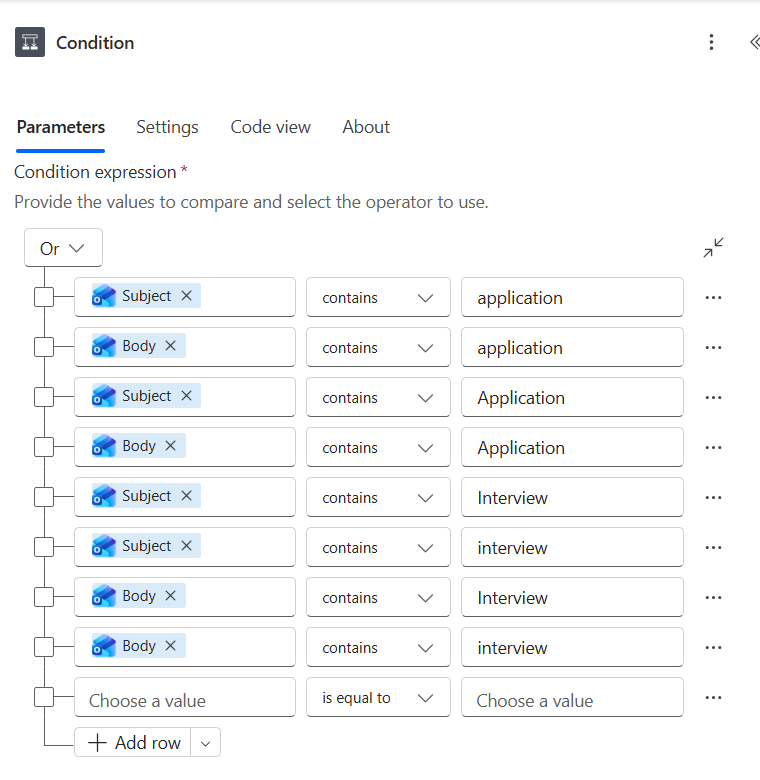
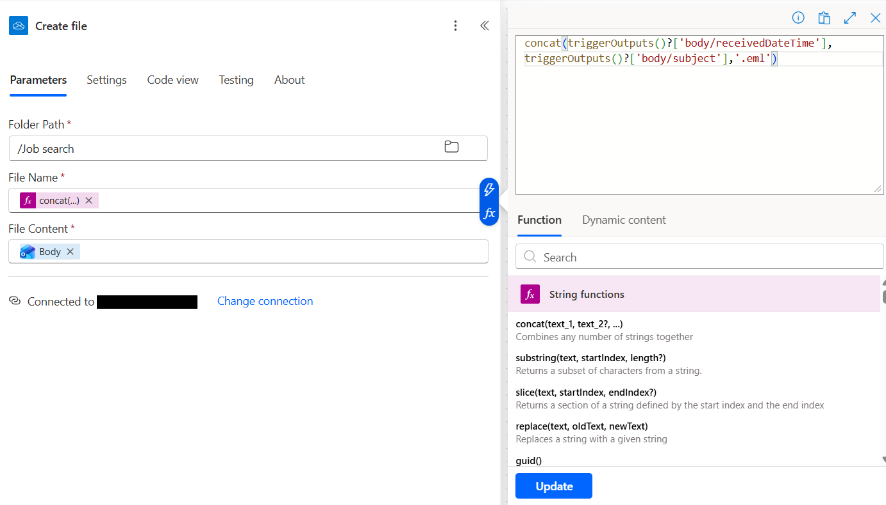
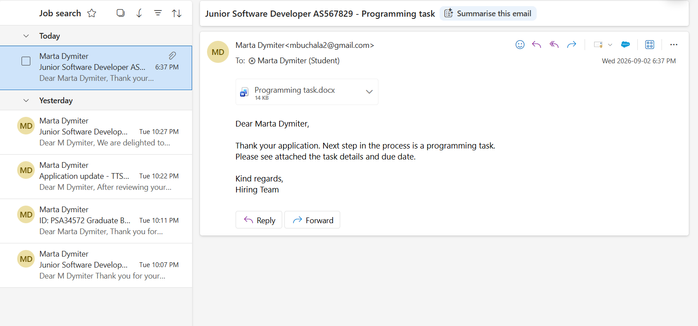
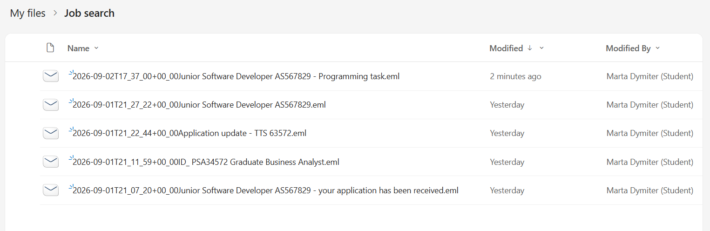
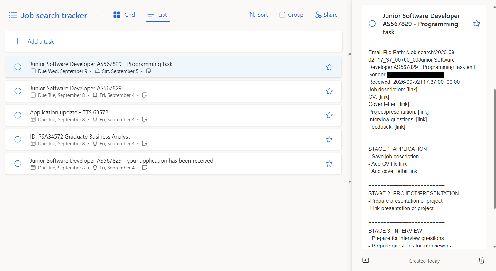

# Job search tracker

Purpose:

To organise and track job applications and related activities during job search.

Applications and services used:
- Microsoft Power Automate
- Microsoft Outlook
- Microsoft OneDrive
- Microsoft To Do

What it does:

The Power Automate cloud flow catches incoming Microsoft Outlook emails and filters them according to key words in subject or body of the email. 
If the keyword is present, the email is moved to "Job search" folder in Microsoft Outlook. The same email is then saved to OneDrive in a .eml format to archive all original information as well as attachments using a name combination of time received and subject to avoid duplicates. 
Lastly, the email details are used to create a new To Do task in Microsoft To Do "Job search tracker" list with due date, reminder, notStarted status and customisable notes outlining tasks and suggesting adding quick access links to documents saved in OneDrive for all stages of the application. This is to be edited in the Microsoft To Do app directly depending on what stage the application is at. The notes provide a consistent template for efficient task categorisation and subtask creation.

Testing:

The flow was tested by sending six emails as follows:
1. Keyword in subject and email body ("application")
2. Keyword in body only ("application")
3. Keyword in subject ("Application") and email body ("application")
4. Keyword in email body only ("interview")
5. Keyword in email body ("application") with a Word Document attachement.
6. No keywords in subject or body.

Results:

The flow successfully run on all six emails, emails no. 1-5 were moved to the folder, archived in OneDrive (with attachment if applicable) and added as To Do task to the "Job search tracker". Email no. 5 was not moved to the "Job search" folder and was not archived or added to the To Do list as expected.

The flow is documented with screenshots saved in this repository. The screenshots are as follows:

Flow in Power Automate

Condition parameters

Move email (V2) action parameters
 action parameters.png)

Export email (V2) action parameters
 action parameters.png)

Create file action parameters

Add a To-do (V3) action parameters
 action parameters.png)

Add a To-do (V3) action body content
 action body content.png)

Emails in "Job search" folder 

Saved emails in OneDrive

To do tasks in "Job search tracker" list

